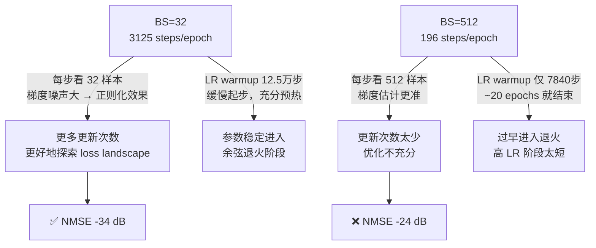

# Batch Size 对 TransNet 性能影响分析

## 1. 实验配置对比

两组实验**唯一差异**是 `batch_size`，其余参数完全一致：

| 参数 | COST2100_bs32 | COST2100 |
|------|:---:|:---:|
| **batch_size** | **32** | **512** |
| lr_init | 2e-4 | 2e-4 |
| scheduler | cosine | cosine |
| epochs | 400 | 400 |
| cr | 4 | 4 |
| weight_decay | 1e-3 | 1e-3 |
| d_model | 64 | 64 |
| dim_feedforward | 2048 | 2048 |

---

## 2. 性能差距

### Indoor 场景 (NMSE, dB, 越低越好)

| Seed | BS=32 | BS=512 | Δ (dB) |
|:----:|:-----:|:------:|:------:|
| seed42 | **-34.10** | -23.87 | **10.23** |
| seed2026 | **-34.58** | -25.39 | **9.19** |
| seed3407 | **-34.64** | -25.53 | **9.11** |
| **平均** | **-34.44** | -24.93 | **9.51** |

### Outdoor 场景 (NMSE, dB)

| Seed | BS=32 | BS=512 | Δ (dB) |
|:----:|:-----:|:------:|:------:|
| seed42 | **-16.25** | -12.40 | **3.85** |
| seed2026 | **-16.03** | -10.64 | **5.39** |
| seed3407 | **-16.40** | -12.01 | **4.39** |
| **平均** | **-16.23** | -11.68 | **4.55** |

### Final Test Loss 对比

| 场景 | BS=32 (seed3407) | BS=512 (seed3407) | 倍数 |
|:----:|:-----:|:------:|:----:|
| Indoor | 1.79e-7 | 1.38e-6 | **7.7x** |
| Outdoor | 1.73e-5 | 5.14e-5 | **3.0x** |

> [!IMPORTANT]
> BS=32 在 indoor 上领先约 **9-10 dB**，在 outdoor 上领先约 **4-5 dB**。这是极其巨大的差距。

---

## 3. 根因分析

### 3.1 核心原因：优化器总步数差 16 倍

这是**最关键的因素**。训练集大小约 100,000 个样本：

| 指标 | BS=32 | BS=512 | 比值 |
|------|:-----:|:------:|:----:|
| steps/epoch | **3125** | 196 | 16x |
| total steps (400 epochs) | **1,250,000** | 78,400 | **16x** |
| warmup steps (10%) | 125,000 | 7,840 | 16x |

代码中使用的是 **step-level** 的 cosine scheduler（每个 optimizer step 调用一次 `scheduler.step()`），而非 epoch-level：

```python
# solver.py _iteration() — 每个 batch 都调 scheduler.step()
if self.model.training:
    self.optimizer.zero_grad()
    loss.backward()
    self.optimizer.step()
    self.scheduler.step()   # ← 每步更新 LR
```

```python
# main.py — T_max 按 total steps 计算
scheduler = WarmUpCosineAnnealingLR(
    optimizer=optimizer,
    T_max=args.epochs * len(train_loader),      # BS32: 1,250,000 | BS512: 78,400
    T_warmup=0.1 * args.epochs * len(train_loader),  # BS32: 125,000  | BS512: 7,840
    eta_min=5e-5)
```

> [!WARNING]
> 虽然 cosine schedule 的 T_max 会自适应总步数，但 **在相同学习率下，BS=32 获得了 16 倍的参数更新次数**。这对小模型来说是决定性的。

### 3.2 训练动态对比：收敛速度天壤之别

```
           BS=32                          BS=512
Epoch  1:  Loss = 9.89e-1                 Loss = 9.997e-1
Epoch  5:  Loss = 4.71e-1   (开始收敛)     Loss = 9.425e-1   (几乎没动)
Epoch 10:  Loss = 6.44e-5   (已经很低!)    Loss = 8.362e-1   (刚开始下降)
Epoch 20:  Loss = 1.85e-5                 Loss = 4.620e-1
Epoch 50:  Loss = 1.63e-6                 Loss = 5.164e-5   (终于追上 bs32 的 epoch10)
Epoch100:  Loss = 5.38e-7                 Loss = 1.404e-5
Epoch200:  Loss = 2.43e-7                 Loss = 4.217e-6
Epoch400:  Loss = 1.42e-7                 Loss = 1.733e-6   (最终仍差 12x)
```

关键观察：
- **BS=32 在 epoch 10 已经达到 6.4e-5**，而 BS=512 在 epoch 10 loss 还在 0.84
- **BS=512 到 epoch 50 才追上 BS=32 的 epoch 10 水平**
- 最终 BS=512 的 train loss (1.73e-6) 比 BS=32 (1.42e-7) 高一个数量级

### 3.3 为什么步数差异影响这么大？



#### 三个叠加因素

**① 参数更新不足（主因）**

TransNet 是一个相对小的模型（权重共享，仅 2 层 encoder + 2 层 decoder）。小模型需要更多的优化步数来充分拟合数据中的精细模式。BS=512 仅提供了 78,400 步，对于这个 CSI 重建任务来说**远远不够**。

**② 梯度噪声的隐式正则化**

小 batch 的梯度估计方差更大，相当于给优化过程加入了隐式噪声。这对过拟合不严重的场景来说是有益的——它帮助模型逃离 sharp minima，找到更平坦的（泛化性更好的）解。

**③ 学习率与 batch size 不匹配**

深度学习中有一个经典结论：**当 batch size 增大 k 倍时，学习率也应相应增大（通常是 √k 或 k 倍）**。这里 BS 从 32 增大到 512（16 倍），但 LR 保持 2e-4 不变。对于 BS=512 来说，这个 LR 实际上**偏小了**。

> [!NOTE]
> 从 outdoor 的额外实验 `seed*_1e-4` 来看，降低 LR 到 1e-4 反而让 BS=512 性能更差（如 seed3407: -12.01 → -10.49），证明 LR 确实需要**增大**而非减小。

---

## 4. 数值验证

我们可以从"等效总样本暴露量"的角度验证：

| 指标 | BS=32 | BS=512 |
|------|:-----:|:------:|
| 每 epoch 看到的样本数 | 100,000 | 100,000 |
| 400 epoch 总样本暴露 | 4000万 | 4000万 |
| **但 optimizer step 数** | **125万** | **7.84万** |

虽然两者看到的总数据量相同，但 BS=32 对模型参数执行了 **16 倍** 的梯度更新。对于这个任务的复杂度，7.84 万步显然不够。

---

## 5. 建议的改进方案

如果需要使用大 batch size（比如为了 GPU 利用率），以下方案可以缩小差距：

### 方案 A：线性缩放学习率（推荐先试）
```bash
# BS 增大 16x，LR 也增大 16x
python main.py --batch_size 512 --lr_init 3.2e-3 ...
# 或用 sqrt scaling: LR 增大 4x
python main.py --batch_size 512 --lr_init 8e-4 ...
```

### 方案 B：增加训练 epoch 数
```bash
# 让总 step 数与 BS=32 相当: 400 * 16 = 6400 epochs
python main.py --batch_size 512 --epochs 6400 ...
```

### 方案 C：梯度累积（模拟小 batch）
在 [solver.py](file:///home/z-jiuri/workspace/Huawei/TransNet/utils/solver.py#L117-L153) 中添加梯度累积：
```python
# 每 16 步才做一次 optimizer.step()，等效于 BS=32
accumulation_steps = 16
for batch_idx, (sparse_gt,) in enumerate(data_loader):
    sparse_gt = sparse_gt.to(self.device)
    sparse_pred = self.model(sparse_gt)
    loss = self.criterion(sparse_pred, sparse_gt) / accumulation_steps
    loss.backward()
    if (batch_idx + 1) % accumulation_steps == 0:
        self.optimizer.step()
        self.scheduler.step()
        self.optimizer.zero_grad()
```

### 方案 D：LARS/LAMB 优化器
专为大 batch 设计的优化器，会根据参数的范数自动调整每层学习率。

---

## 6. 总结

| 因素 | 影响程度 | 说明 |
|------|:--------:|------|
| **优化器总步数不足** | ⭐⭐⭐⭐⭐ | 核心原因，78K vs 1.25M 步 |
| **LR 未随 BS 缩放** | ⭐⭐⭐⭐ | 2e-4 对 BS=512 偏保守 |
| **小 batch 隐式正则化** | ⭐⭐ | 有帮助但非主因 |
| **Warmup 不充分** | ⭐⭐ | BS=512 仅 7840 步 warmup |

> [!TIP]
> 最简单的验证方式：用 BS=512 + `--epochs 6400` 跑一次，如果 NMSE 接近 BS=32 的水平，就证实了"步数不足"是主因。
